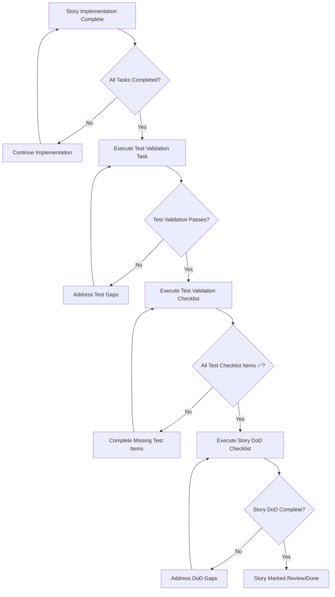

<!-- Powered by BMAD™ Core -->

# Story Completion Workflow with Test Validation

**Purpose:** Comprehensive workflow ensuring test quality and preventing regressions during story completion

**Integration:** Enhances existing BMad story completion with mandatory test validation gates

---

## Workflow Overview

This workflow **REPLACES** the standard story completion process with enhanced test validation to prevent failing tests and ensure comprehensive coverage.



---

## Step-by-Step Execution

### Phase 1: Pre-Validation Setup
**Trigger:** Story implementation claims to be complete

**Actions:**
1. Verify all story tasks are marked complete
2. Confirm functional requirements implemented
3. Ensure development environment is clean

**Command:** Manual verification or automated status check

---

### Phase 2: Test Validation Task
**Trigger:** All story tasks completed

**Command:** 
```bash
*task post-story-test-validation
```

**Purpose:** Comprehensive test analysis and gap remediation

**Requirements:**
- Analyze story scope for test requirements
- Assess current test coverage
- Generate missing tests
- Fix failing tests
- Validate test quality
- Confirm CI compatibility

**Blocking:** Story cannot proceed until this task completes successfully

---

### Phase 3: Test Validation Checklist
**Trigger:** Test validation task completed successfully  

**Command:**
```bash
*execute-checklist post-story-test-checklist
```

**Purpose:** Systematic verification of test coverage and quality

**Requirements:**
- All functional areas have test coverage
- All test suites pass without failures
- No regressions introduced
- Test documentation complete
- Quality standards met

**Blocking:** Story cannot proceed until ALL checklist items are ✅

---

### Phase 4: Standard Definition of Done
**Trigger:** Test validation checklist completed successfully

**Command:**
```bash
*execute-checklist story-dod-checklist  
```

**Purpose:** Standard BMad story completion validation

**Integration:** Enhanced with test validation confidence

**Note:** Testing section of DoD should now be automatically satisfied

---

### Phase 5: Story Completion
**Trigger:** All validation phases completed successfully

**Actions:**
1. Update story status to "Review" or "Done"
2. Document completion with test validation summary
3. Commit changes with test evidence
4. Notify stakeholders of completion

---

## Integration with Existing BMad Commands

### Modified Commands

**Enhanced `*execute-checklist story-dod-checklist`:**
- Now includes reference to test validation completion
- Testing section enhanced with specific test evidence requirements
- Cannot be executed without prior test validation

**Enhanced Story Creation Workflow:**
- New stories include test planning sections
- Test requirements defined during story creation
- Test validation checkpoints built into story templates

### New Commands Available

**`*task post-story-test-validation`:**
- Comprehensive test analysis and remediation
- Generates missing tests automatically
- Fixes failing tests and validates quality
- Required before story completion

**`*execute-checklist post-story-test-checklist`:**
- Systematic test coverage verification
- Quality gate enforcement
- Evidence-based test validation
- Mandatory completion before DoD

---

## Quality Gates & Enforcement

### Mandatory Gates

**Gate 1: Test Coverage**
- Unit tests: 100% for calculations, 95% for core logic
- Integration tests: All handlers and workflows
- Parity tests: All game mechanics validated
- **Enforcement:** Automated coverage reporting, manual review

**Gate 2: Test Quality**
- AAA pattern compliance
- Comprehensive edge case coverage
- Proper dependency mocking
- Clear, descriptive naming
- **Enforcement:** Manual code review, automated linting

**Gate 3: Regression Prevention**
- All existing tests pass
- No breaking changes without migration
- Performance impact within acceptable limits
- **Enforcement:** Automated test execution, performance monitoring

**Gate 4: CI Compatibility**  
- Clean build process
- All test suites pass in CI environment
- Process size and validation constraints met
- **Enforcement:** Automated CI pipeline validation

### Failure Protocol

**When any gate fails:**
1. Story completion is **BLOCKED**
2. Specific failures are documented with remediation steps
3. Developer must address failures before proceeding
4. Re-validation required after fixes

**Exception Process:**
- Exceptions require explicit user approval
- Technical debt must be documented
- Follow-up tasks created for remediation
- Risk assessment documented

---

## Benefits & Impact

### Quality Improvements
- **Prevents Test Regressions:** Comprehensive validation before completion
- **Ensures Coverage:** Systematic identification and creation of missing tests
- **Maintains Standards:** Consistent test quality across all stories
- **Reduces Debugging:** Issues caught before production deployment

### Process Efficiency
- **Automated Validation:** Reduces manual review overhead
- **Clear Checkpoints:** Prevents incomplete story completion
- **Faster Reviews:** Higher confidence in completed work
- **Reduced Rework:** Issues caught early in development cycle

### Development Experience
- **Clear Expectations:** Developers know exact test requirements
- **Automated Support:** Tools generate test skeletons and identify gaps
- **Quality Feedback:** Immediate feedback on test quality and coverage
- **Documentation:** Comprehensive test documentation maintained

---

## Migration from Current Process

### For Existing Stories
1. **In-Progress Stories:** Apply new workflow immediately for any stories not yet marked "Done"
2. **Recently Completed Stories:** Optional retroactive test validation to identify gaps
3. **Legacy Stories:** No retroactive requirements, but follow new process for any changes

### For Development Teams
1. **Training:** Brief team on new workflow and quality gates
2. **Tools:** Ensure all test generation and validation tools are available
3. **Documentation:** Update project documentation with new workflow requirements
4. **Monitoring:** Track compliance and quality improvements

### Implementation Timeline
1. **Phase 1 (Immediate):** New workflow available and documented
2. **Phase 2 (Current Sprint):** Apply to all new story completions
3. **Phase 3 (Next Sprint):** Full team adoption and training
4. **Phase 4 (Following Sprint):** Measure quality improvements and adjust

---

## Success Metrics

### Quality Metrics
- **Test Coverage:** Target 95%+ across all new implementations
- **Regression Rate:** Target <1% of story completions introduce failing tests
- **Test Quality Score:** Automated scoring of test comprehensiveness
- **CI Stability:** >99% green builds after story completion

### Process Metrics  
- **Completion Time:** Track time from implementation to story "Done"
- **Rework Rate:** Percentage of stories requiring post-completion fixes
- **Review Efficiency:** Time required for story reviews
- **Developer Satisfaction:** Survey feedback on workflow effectiveness

### Business Impact
- **Deployment Confidence:** Higher confidence in production deployments
- **Bug Reduction:** Fewer production issues from new features
- **Development Velocity:** Faster feature delivery with higher quality
- **Technical Debt:** Reduced accumulation of test debt

---

## Troubleshooting & Support

### Common Issues
1. **"Test validation task fails":** Check test environment, dependencies, and infrastructure
2. **"Generated tests don't compile":** Verify code templates and generation scripts
3. **"CI pipeline fails after test creation":** Check resource limits and execution time
4. **"Test coverage tools report incorrectly":** Validate coverage tool configuration

### Support Resources
- **Test Generation Tools:** `npm run tdd:generate-tests`
- **Coverage Reporting:** `npm run coverage:report`
- **CI Pipeline Debugging:** Check GitHub Actions logs
- **Test Quality Tools:** Built-in linting and validation

### Escalation Process
1. **Technical Issues:** Document specific failures and context
2. **Process Questions:** Review workflow documentation and examples
3. **Tool Problems:** Check tool documentation and configuration
4. **Quality Concerns:** Consult with technical lead or architecture team

---

## Conclusion

This enhanced workflow ensures **zero tolerance for test regressions** while maintaining development velocity through automation and clear quality gates. By catching test issues early and systematically, we prevent the cycle of "completed stories introducing failing tests" that motivated this improvement.

**Key Success Factors:**
- **Mandatory Compliance:** No exceptions without explicit approval
- **Automated Support:** Tools reduce manual effort while maintaining quality
- **Clear Documentation:** Everyone understands requirements and process
- **Continuous Improvement:** Monitor metrics and refine workflow based on results