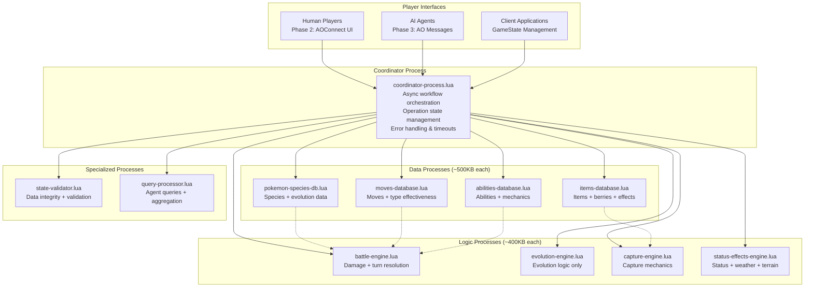

# High Level Architecture

## Technical Summary

The PokéRogue AO migration employs a **26-process stateless architecture with async coordination**, transforming the existing object-oriented TypeScript codebase into specialized, stateless Lua processes that communicate through message passing. The architecture prioritizes **100% behavioral parity** with the current implementation while leveraging process specialization for data and logic separation. Core architectural patterns include async message coordination, stateless process design, specialized data/logic process separation, and comprehensive TDD with parity validation, directly supporting the PRD's goal of creating the world's first fully UI-agnostic roguelike where AI agents battle as first-class citizens.

## High Level Overview

**Architectural Style:** **26-Process Stateless Architecture with Async Coordination**
- 26 specialized stateless Lua processes (data processes, logic processes, coordinator)
- Async message passing coordination via coordinator-process for complex workflows
- Each process under 500KB size constraint with complete self-contained functionality
- No persistent state within processes - GameState flows through processes

**Repository Structure:** **Monorepo** (from PRD Technical Assumptions)
- `/processes/` - 26 stateless Lua processes (battle-processor.lua, pokemon-species-db.lua, etc.)
- `/testing/` - Comprehensive TDD framework (aolite unit tests, aos-local integration, parity validation)
- `/tools/` - AO sandbox validation, process size monitoring, performance testing
- `/fixtures/` - Test data and golden master outputs for parity validation
- `/typescript-reference/` - Current implementation for parity testing

**Service Architecture:** **Distributed Process Topology with Coordinator-Led Orchestration**
- Data processes (pokemon-species-db, moves-database, items-database, abilities-database)
- Logic processes (battle-engine, evolution-engine, capture-engine, status-effects-engine)  
- Coordinator process orchestrates multi-step async workflows
- Client-side or coordinator-side GameState persistence
- Fixed process topology - all processes known at deployment

**Primary Data Flow:** **Client → Coordinator → Data Processes → Logic Processes → Final Result → Client**
1. Client sends coordinated request to coordinator-process with GameState
2. Coordinator orchestrates async data collection from specialized data processes
3. Coordinator sends collected data + GameState to appropriate logic process
4. Logic process performs calculations and returns updated GameState
5. Coordinator returns final result to client with updated GameState

**Key Architectural Decisions:**
- **Process Specialization:** Data processes (pure reference data) vs Logic processes (pure computation)
- **Stateless Design:** No persistent state in processes - GameState flows through system
- **Async Coordination:** Coordinator orchestrates complex multi-step workflows via message passing
- **Size Optimization:** Each process <500KB through aggressive inlining and data compression
- **Agent-First:** Rich query interfaces and standardized message protocols for agents
- **Generic Response Pattern:** All processes return via "SaveState" action for uniform client handling

## High Level Project Diagram

## Architectural and Design Patterns

- **Stateless Process Pattern:** Each process receives complete state, performs computation, returns updated state - _Rationale:_ Pure functional design enables horizontal scaling, fault tolerance, and deterministic behavior

- **Async Message Coordination:** Coordinator orchestrates multi-step workflows via message passing without blocking - _Rationale:_ Leverages AO's async-only design while maintaining complex workflow capabilities

- **Process Specialization:** Data processes (pure reference data) vs Logic processes (pure computation) - _Rationale:_ Optimal resource utilization and clear separation of concerns within 500KB constraints

- **Generic Response Protocol:** All processes return via uniform "SaveState" action regardless of input specificity - _Rationale:_ Simplifies client handling while preserving type safety on input side

- **Self-Contained Process Design:** Each process embeds all required data and functionality in single deployable file - _Rationale:_ Eliminates dependencies, ensures deployment consistency, enables independent scaling

- **Operation State Machine:** Coordinator maintains operation lifecycle (pending → active → completed) - _Rationale:_ Enables complex multi-step workflows with proper error handling and recovery

- **Client-Side State Persistence:** GameState persisted by client or external systems, not within processes - _Rationale:_ Maintains stateless design while enabling complex game state management

- **Deterministic Computation:** All random operations use seeded RNG passed as message data - _Rationale:_ Enables replay, debugging, and cross-platform consistency without process-local state

- **Size-Constrained Optimization:** Aggressive inlining and data compression within 500KB limits - _Rationale:_ Maximizes functionality while respecting AO platform constraints
